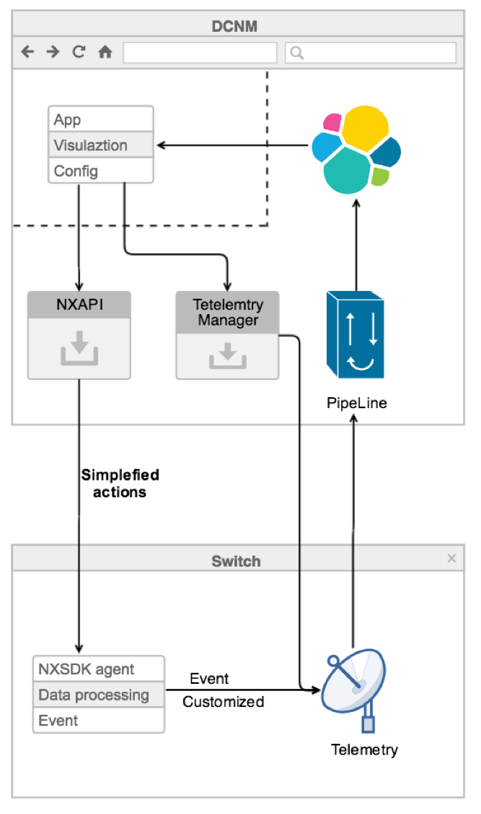
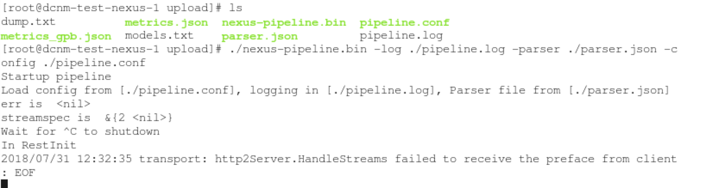

DCNM AWF UI Development Guild for AngularJS
============================================
This file is to instruct how to use DCNM AWF and Services in DCNM (ES, UTR, NXAPI) with AngularJs
****
|Author|Cal Huang|
|---|---
|Email|calhuang@cisco.com
****
Table of Contents
-------------------

* Cisco NX-SDK and DCNM AWF
* [Structure](#structure)
* [Package](#package)
  * [App specification](#app specification)
  * [Docker image](#docker image)
  * [Icon](#icon)
* [AngularJS](#angularjs)
  * [Dependency](#dependency)
  * [Build](#build)
  * [Charts](#charts)
* [Infra](#infra)
  * [ElasticSearch](#elasticsearch)
  * [UTR](#utr)
  * [NXAPI](#nxapi)
* [FQA](#fqa)

## Cisco NX-SDK and DCNM AWF

### NX-SDK

Cisco NX-SDK provides a simple, flexible, modernized and powerful tool for off the box third party custom Application development to gain access to Nexus infrastructure functionalities which when run inside the Nexus switches allow the custom applications to run natively just like any other Cisco native Nexus applications. It is appropriate for Do-it-Yourself Automation to develop custom applications to fit your needs thereby decoupling application development from Nexus releases. NX-SDK offers various functionalities like ability to generate custom CLIs, Syslogs, Event manager, HA, Route Manager, Streaming Telemetry and much more.

NX-SDK provides Abstraction/plugin Library Layer thereby decoupling the Application from underlying infrastructure being used. Hence, its easy and simple to change infra without affecting the applications. Hence, NX-SDK is being used for developing native Cisco Applications as well.

It is built using C++ language. Other language (python, go, ruby etc) bindings will also be provided for NX-SDK hence custom applications can be developed and built in any language of users choice.

This github provides NX-SDK toolkit for custom application development in your favorite Linux environment to gain access to NX-OS infrastructure.

For more detail, went to this link: <a href="https://github.com/CiscoDevNet/NX-SDK/">NX-SDK releases</a>

### DCNM AWF

Application frame Work for DCNM is an Infrastructure on DCNM which adds scalability and agility for DCNM application development. Developing applications on DCNM involved writing software that was tightly integrated with everything on DCNM. This resulted in having to wait for DCNM releases to provide a release vehicle for applications that are to be delivered to the customer. The new Frame work adds the ability to develop applications in a separate dev-ops kind of model.

An application can be built using any programming language and deployed onto a production DCNM.

An application can be upgraded anytime on a production DCNM with significantly smaller downtime.

DCNM will be scalable such that it can utilize Compute infra incrementally for newer applications

## Structure

  

The application include a nxsdk agent running on switch, and a AFW app running in DCNM. Infras include elasticsearch, pipeline , nxapi , telemetry manager and restfulapi, are used.
No code change needed for pipeline. Only needs to change is 2 config file.
ES mapping and template is needed.
The app part provide the simplified user interface, it send simplified instruction to NXSDK agent, and NXSDK agent send customized event data to telemetry, then telemetry stream data to pipeline and ES, then app do the visualization and more analysis.

## Package

If you already have an angularjs project, follow this step to make it a AWF application
- build the project to production code, adjust the absolute path to relative paths
- build app package with script
- upload package to DCNM

A DCNM application is comprised of the following
- An application specification, <a href="packDir/spec.yml">spec.yml</a>
- A Docker container image as a simple tar ball, <a href="packDir/image.tar">image.tar</a>
- An icon that best depicts the application on the DCNM Catalog, for example <a href="packDir/icon.png">icon.png</a>

A simple example script to generate package, <a href="dcnmPackage.sh">dcnmPackage.sh</a>
Sample usage : ./dcnmPackage.sh routetracker:v1 routetracker

### App specification

- Name: APP Name
A Name for this application. It is suggested to choose a unique name for the application
- AppId: <App_name>
An AppId is App Name without spaces. It can contain '-' special character. Example (epl_1)
- Vendor: <Vendor_name>
Vendor is the app vendor who is managing and releasing the app. Example (Cisco etc)
- Version: <version>
Version can only have ‘.’ special character. Example (0.1 or 0.1.2)
- Tag: <imageName>:<version>
An image tag. This should follow the format of <imageName>:<Version>. Version
cannot be simply latest. It has to be a decimal denoting Min and Max version.
The imageName has to be unique across different applications
- Description: Template APP specification

- Depends:
The following Tag Describes Dependency images for this App to be runnable. In order to
deploy the app following images need to be available on the DCNM.

Category: Application / Infra
A Meaningful representation of the image category. Use one of Application or Infra

- Resource:
The Resources this Application needs to correctly run. This section describes volumes.
CPU Memory and Network. These values are editable on the DCNM after it is uploaded
while the image is not deployed.

- GUI:
If this application has GUI then they are listed below.
App needs to be specify atleast one of Integrated or Offloaded Option.
An integrated GUI essentially means that the APP has its own webserver and content
to serve. DCNM will plumb a dynamic port into the App. The plumbing is only
between DCNM Server and Compute. This port is not externally visible through
any worker nodes. Only one such port is supported per application. This value does
not have to be unique across multiple applications.
  Integrated:
  Port: 80
  Protocol: http

For more detail: <a href="docs/AFWUserGuide.docx">AFWUserGuide</a>

### Docker image

Compile the AngularJS project to production code with command:＜/br＞
ng build --prod
Make sure you are using the relative paths:＜/br＞
  yourProject -> dist -> index.html＜/br＞
  at line 6＜/br＞
  change "/" to "./"
Sample code <a href="dist/index.html">index.html</a>

Host the compiled code using docker with nginx＜/br＞
Check Dockerfile for more detail <a href="Dockerfile">Dockerfile</a>

### Icon
File name needs to be icon.png

## AngularJS
### Dependency
Check <a href="package.json">package.json</a> for dependency.

There are some that used a lot:
- "@angular/http": "^6.0.0",
make get/post call
- "angular-smart-table": "^2.1.11",
make table with checkbok and search
- "angularjs-tooltips": "^1.0.5",
show tooltips
- "elasticsearch-browser": "^15.0.0",
support ES function
- "highcharts": "^6.1.0",
draw charts

### Charts

## Infra

Infra inside DCNM include service ES and api like nxapi.

For the Services provide by DCNM (app), service discovery is needed to find out the port of the services. After the port is found, Service can be used as standalone service.

For the api, please search specific api for more instruction.

#### ElasticSearch
ES
To get the data in ES:
Requirement:
- elasthicsearch.js (install elasticsearch-browser with npm in angular)
- ES is running

Steps:

- Service discovery for port
- connect to ES
- search with query

For Sample code for Service discovery, check <a href="src/app/Service/elasticsearch.service.ts">elasticsearch.service.ts</a> function AfwDiscoverService

For connect to ES, check function connectToES

for usage, check <a href="src/app/layout/rpms/routeTracker/charts/charts.component.ts">charts.component.ts</a>

#### UTR
There is 2 way to use UTR/pipeline in DCNM:
- start UTR as binary (for dev)
- run UTR as container (for production)

- Binary
  - set pipeline.conf and parse.json
  - run binary use this line: ./nexus-pipeline -log ./pipeline.log -config ./pipeline.conf -parser ./parser.json

  

    
  

"transport:http2Server.HandleStreams failed to receivedthe preface from client" has no influence so far.
- Container

TODO

#### NXAPI
One way to run NXAPI through dcnm is through rest/epl/nx-api-invoke.
**Alert, DCNM may not support nxapi call with normal token, please check with dcnm team to get more detail.**
**this api cannot run 2 clis in one call**

Step:
- get dcnm Token
- add token to header
- make nxapi call

For dcnm Token check <a href="src/app/Service/nxapi.service.ts">nxapi.service.ts</a>
function getDcnmToken()
For make nxapi call, check function preRunCli(cli, switches, appName)
For usage, check onWatch() in <a href="src/app/layout/rpms/routeTracker/routeTracker.component.ts">routeTracker.component.ts</a>

## FQA
### What should I do if I get "redirect fail, please try again"?
Wait for around 10-30min
